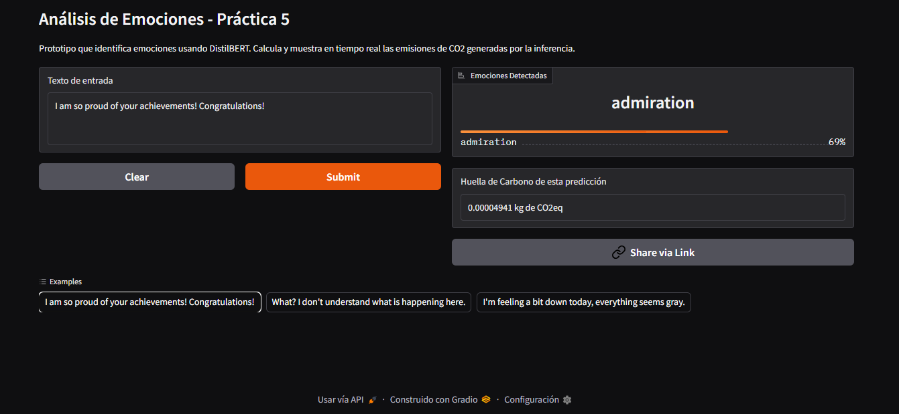
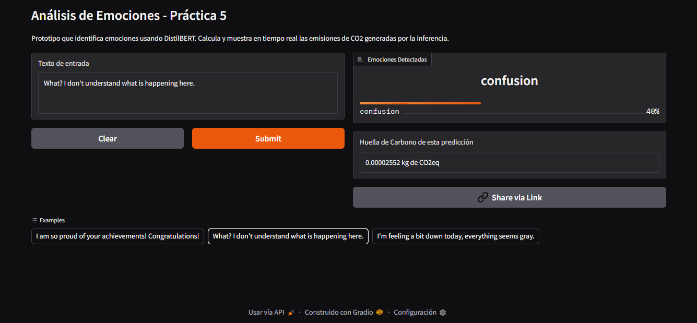

# Práctica 5: Transformers via Hugging Face - Análisis de Emociones

**Equipo:** [Choper]

**Integrantes:** 
* [Zaira Daniela Ortega Hernández]

**URL del Proyecto en Producción:** [https://huggingface.co/spaces/ZaiOH/goemotion-classifier-co/tree/main]

---

## 1. Descripción del Proyecto
Este proyecto implementa un modelo de Procesamiento de Lenguaje Natural (NLP) capaz de clasificar textos en inglés en 28 emociones diferentes. Para lograrlo, se realizó un *fine-tuning* del modelo base pre-entrenado `distilbert-base-uncased` utilizando el dataset `go_emotions` (versión simplificada). 

La aplicación fue puesta en producción utilizando **Gradio** y está alojada en un **Hugging Face Space**.

---

## 2. Desempeño: ¿Qué tan bien se resolvió la tarea?
El modelo obtuvo un **Accuracy de 58.4%** (`eval_accuracy: 0.584`) durante la fase de evaluación. 

Aunque en problemas de clasificación binaria este porcentaje podría parecer bajo, en este contexto es un resultado bastante positivo debido a que:
1. El modelo tiene que elegir entre **28 emociones distintas** (no solo positivo/negativo).
2. Se utilizó un subconjunto reducido del dataset para optimizar los tiempos de entrenamiento en el entorno de desarrollo.
3. Se utilizó un modelo ligero (`DistilBERT`).

Al probar la aplicación manualmente, el modelo demuestra una excelente comprensión del contexto real. Por ejemplo:
* Ante la frase *"I am so proud of your achievements! Congratulations"*, el modelo predijo correctamente **admiration** (0.69) como emoción principal.

*(Prueba 1: Detección de emociones positas)*

* Ante la frase *"Whta? I don´t undertand what is happening here"*, el modelo identificó correctamente **confusion** (0.40).

*(Prueba 2: Detección de confusión)*

## 3. Utilidad de la Aplicación
Esta herramienta resulta sumamente útil para tareas de análisis de sentimiento profundo. Más allá de saber si un cliente está "feliz" o "enojado", aplicaciones como esta pueden integrarse en:
* **Monitoreo de redes sociales:** Para detectar crisis de relaciones públicas (ej. niveles altos de *disgust* o *anger* en comentarios).
* **Atención al cliente:** Para priorizar automáticamente tickets de soporte donde los usuarios muestran *frustration* o *annoyance*, canalizándolos con agentes humanos especializados.
* **Salud mental:** Como herramienta de apoyo para identificar patrones de *grief* o *sadness* en foros de apoyo.

---

## 4. Retos y Dificultades

### Durante el Fine-Tuning (Entrenamiento)
* **Dimensionalidad y tensores:** El mayor reto técnico fue adaptar el dataset original al formato esperado por el `Trainer` de Hugging Face. La columna original de etiquetas venía estructurada como una lista de enteros (`[int]`), lo cual generaba errores (`ArrowInvalid` y `ValueError`) al intentar convertir los datos en tensores. La solución fue mapear el dataset para extraer el primer elemento de la lista y **sobrescribir** la columna `labels` original, asegurando que todos los lotes tuvieran dimensiones uniformes.

* **Riesgo de Overfitting:** Al utilizar un dataset pequeño, existía el riesgo de sobreajustar el modelo si se utilizaban demasiadas épocas (epochs). Se ajustaron los hiperparámetros a un balance ideal para aprender sin memorizar.

### Durante la Puesta en Producción
* **Optimización de dependencias:** Fue necesario depurar el archivo `requirements.txt` para incluir únicamente lo estrictamente necesario (`transformers`, `torch`, `codecarbon`), dejando fuera librerías de entrenamiento como `evaluate` para hacer el contenedor más ligero y rápido de desplegar.

* **Integración de métricas ambientales en la UI:** Configurar CodeCarbon para que sus resultados fueran visibles en tiempo real en la interfaz de Gradio requirió abandonar el decorador automático (`@track_emissions`) e implementar un inicio/apagado manual del `OfflineEmissionsTracker` dentro de la función de predicción.

---

## 5. Reporte de Emisiones (Punto Extra - CodeCarbon)
Como parte del desarrollo responsable, se integró monitoreo de huella de carbono utilizando **CodeCarbon**.

* **Fase de Entrenamiento:** El proceso de *fine-tuning* en GPU registró un consumo energético documentado en el archivo `emissions.csv` adjunto en el repositorio.

* **Fase de Inferencia (Producción):** Se implementó el medidor directamente en la interfaz. Debido a la alta eficiencia del modelo ligero (DistilBERT), inferencias de textos cortos en CPU generan una huella tan baja que requiere alta precisión decimal para medirse, reportando un aproximado de `0.00000000 kg de CO2` por inferencia individual, lo que demuestra que el modelo es altamente sostenible para uso continuo en producción.