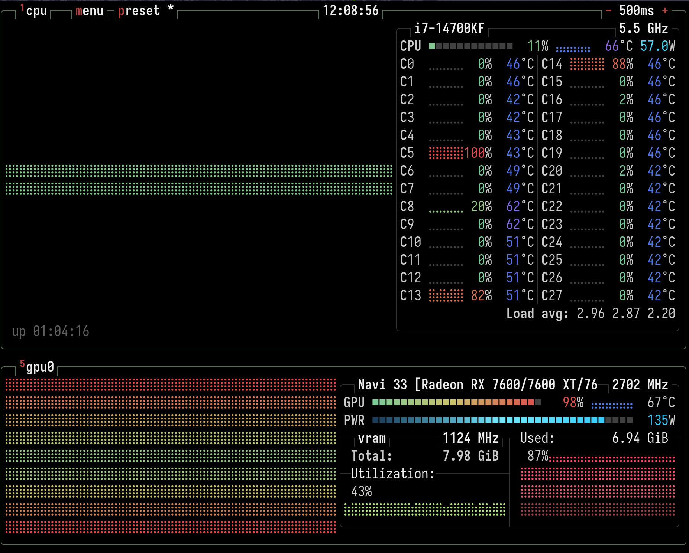

# Practica 5 - Fine tunning y puesta en producción

[https://ununtitled.hiperboli.co](https://ununtitled.hiperboli.co)

## El problema

Originalmente escogimos el problema de predecir, o sugerir, títulos para artículos científicos a partir de su _abstract_.
Esto pues existen muchos _datasets_ basados en el repositorio de _preprints_  [arXiv](https://www.arxiv.org).

Ante las dificultades que se presentaron, y sobre todo en la evaluación, decidimos intentar otro problema:
predecir la categoría asignada a un artículo a partir de su _abstract_.

## Dataset

Como ya mencionamos, existen múltiples _datasets_ basados en los _preprints_ de _arXiv_.
Por conveniencia utilizamos [Huggingface](https://huggingface.co/).

Escogimos el dataset **`gfissore/arxiv-abstracts-2021`**.

Este dataset recopila información de los preprints desde la creación de _arXiv_ hasta el 2021.

Cada registro contiene el identificador único del artículo, los autores, el título, las categorías temáticas asignadas y el _abstract_.

### Ficha técnica del dataset

| Característica | Detalle |
| --- | --- |
| **Nombre en Hugging Face** | `gfissore/arxiv-abstracts-2021` |
| **URL del Dataset** | [huggingface.co/datasets/gfissore/arxiv-abstracts-2021](https://huggingface.co/datasets/gfissore/arxiv-abstracts-2021) |
| **Cantidad Total de Datos** | ~1.93 millones de artículos científicos |
| **Idioma Principal** | Inglés (jerga técnica, académica y científica) |
| **Columnas Clave Utilizadas** | `title` (Título), `abstract` (Resumen), `categories` (Disciplinas) |
| **Formato de Archivo Original** | JSON Lines (`.jsonl`) comprimido |
| **Tipo de Tareas Comunes** | Resumen automático, Clasificación de texto, Generación Seq2Seq |

## Modelo

Utilizamos un modelo pre-entrenado Seq2Seq basado en la arquitectura de _transformers_.
La elección del modelo respondió principalmente a la necesidad de tener un modelo versatil que pudiera atacar
diversos problemas de procesamiento de lenguaje natural,
pero que pudiera ser entrenado en un tiempo razonable en un equipo de cómputo casero.

Por lo anterior escogimos el modelo **Flan-Tl5** de _Google_.

Cabe destacar que _Flan-T5_ es un modelo con estructura **Encoder-Decoder**.
Por lo que a diferencia de modelos Encoder-only (como BERT), Flan-T5 opera bajo un paradigma estrictamente de texto a texto.
Todo problema, ya sea clasificación, traducción o resumen, se reformula para que el modelo reciba una cadena de texto y genere otra cadena de texto.

## Estrategia de Fine-Tuning

El entrenamiento se abordó mediante un fine-tuning supervisado.
En lugar de modificar últimas capas de la red neuronal,
se utilizaron cadenas con instrucciones estáticas junto con los datos de entrada para influenciar la salida del Decoder.
En otras palabras, se utilizó un _prompt_ ( como "Generate title for abstract: ...")
para forzar al modelo a resolver cada una de las tareas planteadas.

Se minimizó la pérdida de entropía cruzada iterando sobre los tokens objetivo.
Para la clasificación, el modelo aprendió a generar los caracteres exactos de la categoría en lugar de predecir un índice numérico.
Se entrenaron dos instancias separadas del modelo para evitar la interferencia de objetivos, manteniendo pesos independientes para la generación de títulos y para la clasificación.

Dado que el dataset es demasiado grande, y después de hacer pruebas con algunos pocos elementos del mismo, se decidió entrenar con 50,000 ejemplos.
Además, para evaluar el progreso del entrenamiento, se hicieron 10 evaluaciones durante el proceso.

Después de algo de experimentación en _notebooks_ de _Colab_, se optó por utilizar _scripts_ de python para el entrenamiento.

Véase [titles/train.py](titles/train.py) y [categories/train.py](categories/train.py)

## Evaluación

Debido a la naturaleza de las dos tareas, se implementó una estrategia de evaluación para cada una de ellas.

### Tarea de generación de títulos

Evaluar texto libre requiere medir tanto la precisión léxica como la retención semántica.

| Métrica | Justificación |
| --- | --- |
| **ROUGE (1, 2, L)** | Mide la superposición de n-gramas entre la predicción y la referencia. ROUGE-1 verifica 1-gramas, por lo que principalmente evlúa coincidencia de términos, mientras que ROUGE-L verifica que la estructura gramatical general del título tenga sentido. |
| **BERTScore** | ROUGE penaliza estrictamente el uso de sinónimos. BERTScore resuelve esto calculando la similitud coseno entre los embeddings de los tokens generados y los de referencia, por lo que no importa si las palabras cambian, mientras el significado sea similar. |

### Tarea de clasificación

Al operar Flan-T5 como un clasificador generativo, para la evaluación es necesario convertir las cadenas de texto generadas en las categorías predefinidas.
Cabe señalar que en el _dataset_ no todas las clases están bien representadas.

| Métrica | Justificación |
| --- | --- |
| **Accuracy** | Proporciona la proporción base de predicciones donde la cadena generada coincide exactamente con la etiqueta real. |
| **F1-Score (Macro)** | Esta métrica es necesaria para este modelo debido al alto desbalance en las categorías de arXiv. |

El uso del F1-Score Macro asegura que el modelo no obtenga puntajes altos simplemente ignorando clases minoritarias.

## Resultados

### Modelo de generación de títulos

Este modelo muestra una progresión muy estable.
El `eval_loss` disminuye constantemente y las métricas de generación (tanto léxicas como semánticas) mejoran con cada época.
Mostramos las primeras 5 evaluaciones. Véase [Evaluación completa.](titles/training_metrics.csv)

| Época | Eval Loss | ROUGE-1 | ROUGE-2 | ROUGE-L | BERTScore-F1 |
| --- | --- | --- | --- | --- | --- |
| **0.5** | 1.8780 | 0.4309 | 0.2317 | 0.3887 | 0.8445 |
| **1.0** | 1.8271 | 0.4315 | 0.2351 | 0.3870 | 0.8468 |
| **1.5** | 1.7918 | 0.4310 | 0.2292 | 0.3834 | 0.8461 |
| **2.0** | 1.7723 | 0.4415 | 0.2428 | 0.3976 | 0.8478 |
| **2.5** | 1.7739 | 0.4435 | 0.2498 | 0.4015 | 0.8482 |

El tiempo de entrenamiento fue de **3 horas y 51 minutos**.

### Modelo de clasificación

Aquí podemos observar claramente la línea base en el paso 0, donde el modelo no acierta ninguna categoría.
A medida que avanza, el modelo aprende rápidamente la tarea, logrando su mejor exactitud en la época 2.5 antes de empezar a mostrar algunos signos de sobreajuste.
Véase [Evaluación completa.](categories/training_metrics.csv)

| Época | Eval Loss | Accuracy (Exactitud) | F1-Macro |
| --- | --- | --- | --- |
| **0.0** *(Base)* | 5.6832 | 0.0000 | 0.0000 |
| **0.5** | 0.2818 | 0.5120 | 0.2291 |
| **1.0** | 0.2317 | 0.5860 | 0.2919 |
| **1.5** | 0.2220 | 0.5860 | 0.3482 |
| **2.0** | 0.1915 | 0.6520 | 0.3878 |
| **2.5** | **0.1826** | **0.6580** | **0.4343** |
| **3.0** | 0.1914 | 0.6500 | 0.4290 |

El tiempo de entrenamiento fue de **3 horas y 46 minutos**.

## Puesta a producción.

Se decidió utilizar un servidor VPS con una capacidad de 12 GB de memoria RAM y 6 vCPUs para desplegar el modelo.

Utilizamos [Streamlit](https://streamlit.io/) para el servidor y la interfaz web.

Además se utilizó [Uv](https://docs.astral.sh/uv/) como gestor de paquetes y entornos virtuales para python,
mismo que junto con [docker](https://podman.io/) permitió un despliegue sin complicaciones.

## Retos y dificultades

### Algunos problemas relativos al _hardware_

Se utilizó un equipo con GPU modelo **AMD RX 7600**, mismo que cuenta con 8 GB de VRAM.
Dado que las APIs utilizadas por equipos AMD son distintas a las que utilizan equipos NVIDIA, mismos que son más comúnes,
es necesario hacer diversos ajustes en el proceso de entrenamiento. Algunos de estos ajustes surgieron sobre la marcha al encontrar errores
(algunas veces crípticos) en el proceso de entrenameinto.

Se debió deshabilitar `fp16` para evitar errores numéricos (NaN) y forzar el uso de `bf16` para garantizar la estabilidad durante el cálculo de gradientes.
Para ajustarse al límite de 8GB de VRAM, se implementó una estrategia de acumulación de gradientes (`gradient_accumulation_steps=4`) con un tamaño de lote mínimo (`batch_size=2`).

La integración de CodeCarbon falló debido a fallas silenciosas en las que CodeCarbon detecta la GPU, pero reporta 0Kwh de energía consumida.

### Utilizar un modelo generativo para clasificación
Forzar a un modelo generativo a actuar como un clasificador implicó diseñar *prompts* condicionales estrictos (`"classify abstract: "`) y acotar la generación a un máximo de 16 tokens.

### Puesta en producción

Para

El despliegue en el VPS requirió alojar dos modelos T5 (Generador y Clasificador) simultáneamente. Se solucionó utilizando `@st.cache_resource` en Streamlit para cargarlos en la memoria RAM una sola vez, limitando los hilos de PyTorch (`torch.set_num_threads`) para no saturar el procesador del servidor.

## Conclusiones
### Desempeño de los modelos

El uso del paradigma unificado a través de Flan-T5 probó ser efectivo para resolver ambas tareas de forma independiente:

* **Generación de títulos:** El modelo logró una convergencia aceptable, produciendo títulos semánticamente precisos respecto al abstract de entrada. La inclusión de métricas duales (ROUGE para coincidencia léxica y BERTScore para similitud semántica) permitió monitorear que el modelo no solo memorizara palabras, sino que entendiera el contexto del documento.
* **Clasificación Temática:** El modelo aprendió a generar correctamente las etiquetas de arXiv. A pesar del fuerte desbalance en el dataset original (con clases mayoritarias dominantes), el monitoreo continuo del *F1-Score Macro* garantizó que el sistema mantuviera un rendimiento aceptable a lo largo de toda la distribución de categorías.

### Utilidad

Aunque el desempeño de los modelos es aceptable, las tareas siguen siendo "de juguete", y tendrían poca aplicabilidad en la vida real.
Tal vez podrían servir para ayudar a clasificar rápidamente artículos nuevos recién subidos a arXiv,
o para sugerir un cambio de categoría al autor.

Posiblemente un modelo más útil sería uno que sugiera artículos similares a un artículo dado, una herramienta que podría ser útil
a lo autores, para evitar la duplicidad de artículos, como para los lectores, pues podría sugerir artículos relacionados al que se está leyendo.

## Consumo energético

Como ya mencionamos, hubieron problemas para usar CodeCarbon en la fase de entrenamiento (en la inferencia sí funcionó)
Analizando los registros de entrenamiento obtuvimos el tiempo total de entrenamiento, y considerando que el uso de la GPU y CPU fue casi constante,
utilizamos métricas que obtuvimos directamente del sistema, durante el entrenamiento.

### Consumo de potencia

* **GPU (AMD RX 7600):** ~130 W
* **CPU:** ~65 W
* **Consumo base del sistema (Placa, RAM, SSD):** ~25 W (estimación estándar para PC de escritorio)

**Potencia total ($P$):** 220 W = **0.22 kW**

### Estimación de energía y emisiones

Para calcular la huella de carbono en un entorno doméstico en la Ciudad de México, utilizamos el Factor de Emisión del Sistema Eléctrico Nacional (SEN) actualizado por la SEMARNAT para el periodo vigente, el cual es de **0.444 kg CO2e / kWh**.

** Energía total consumida ($E$)**
La energía es el producto de la potencia por el tiempo ($E = P \times t$):

* $E$ = 0.22 kW × 3.86 horas = **0.849 kWh**

** Huella de carbono ($C$)**
Las emisiones se calculan multiplicando la energía por el factor de emisión ($C = E \times EF$):

* $C$ = 0.849 kWh × 0.444 kg CO2e/kWh = **0.377 kg CO2e**
